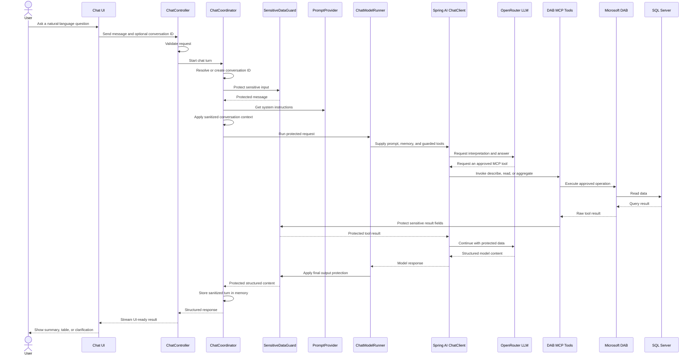

# Read-only SQL MCP AI Assistant — POC Architecture

## Executive summary

This proof of concept (POC) lets business users ask natural-language questions about SQL Server data through an existing chat interface. A single Spring Boot coordinator applies system instructions, sanitized conversation context, PII safeguards, and structured-response handling. The LLM interprets the request but never connects directly to the database: approved Microsoft Data API Builder (DAB) MCP tools mediate access, mutation tools are disabled, and SQL Server access is read-only. Authentication and enterprise authorization are future production capabilities, not features of the current POC.

## Architecture at a glance

The editable source diagram is available at [docs/sql-mcp-poc-architecture.drawio](sql-mcp-poc-architecture.drawio). Open it with [diagrams.net](https://app.diagrams.net) or the draw.io VS Code extension. A vector version is also available at [docs/sql-mcp-poc-architecture.svg](sql-mcp-poc-architecture.svg) for slides and printed handouts.

The dotted green boundary is the current **single-coordinator Spring Boot runtime**. It is not a multi-agent design. The yellow LLM sits outside that boundary, and the teal layer at the bottom is the only route to SQL Server data.

Reading the diagram in one pass:

| Band | What it shows |
|---|---|
| Top | The business user, the chat UI, and authentication as a future production capability. |
| API | The ChatController that validates requests and returns results. |
| Dotted green box | The Spring Boot agent runtime: coordinator, prompt, model runner, chat client, PII guardrail, sanitized memory, and structured response. |
| Right | The OpenRouter LLM, external to the runtime and with no database connection. |
| Bottom | The approved DAB MCP tools, Microsoft Data API Builder, and read-only SQL Server. |

## Runtime flow

## Safety controls

- The LLM does not directly access SQL Server.
- DAB MCP exposes only approved describe, read, and aggregate tools; mutation tools are disabled.
- SQL Server access uses a dedicated read-only database role.
- PII is protected in user input, model output, and database tool results.
- Conversation memory stores only sanitized context and remains in memory for the POC.
- A strong system prompt reinforces read-only behavior, schema grounding, prompt-injection resistance, and hallucination prevention.
- A typed structured response makes UI rendering predictable and turns parsing failures into controlled errors.
- Prompting is not the sole security control: application guardrails, DAB configuration, and SQL Server permissions enforce the key boundaries.

## Component responsibilities

| Component | Responsibility |
|---|---|
| Chat UI | Collects questions and renders streamed, structured results. |
| ChatController | Validates API requests and delegates chat turns. |
| ChatCoordinator | Coordinates one request across privacy, prompt, memory, tools, model, and response handling. |
| PromptProvider | Supplies strong system instructions and request-time date context. |
| SensitiveDataGuard | Protects PII in input, tool results, logs, and final output. |
| ChatModelRunner | Applies primary/fallback model policy and converts model output to the response contract. |
| Spring AI ChatClient | Connects the application to OpenRouter and guarded MCP tool callbacks. |
| OpenRouter LLM | Interprets questions and requests tools; it has no direct database connection. |
| Sanitized Conversation Memory | Retains bounded, protected context for simple follow-up questions. |
| Structured Response | Carries status, summary, tabular data, notes, and follow-up information to the UI. |
| DAB MCP Tools | Provide approved schema discovery, record reading, and aggregation operations. |
| Microsoft DAB | Mediates the configured entities and read-only operations. |
| SQL Server | Stores source data and enforces read-only access for the DAB identity. |

## Current scope and future scope

| Current POC | Future / Production |
|---|---|
| Natural-language database questions | Production authentication with OIDC |
| Read-only data access | Role-based authorization (RBAC) |
| Structured UI response | AI evaluation and regression testing |
| PII-safe output and protected tool results | Schema RAG if schema size or complexity grows |
| Simple follow-up context using sanitized memory | Multi-agent orchestration only if distinct business domains require it |

## How to explain this POC in one minute

> This POC demonstrates a controlled way to connect AI with enterprise SQL data. The user asks a natural-language question. The Spring Boot application applies PII protection, strong instructions, conversation context, and structured response handling. The LLM helps interpret the request, but it does not directly access the database. Data access happens only through Microsoft DAB MCP tools using read-only SQL Server access.
