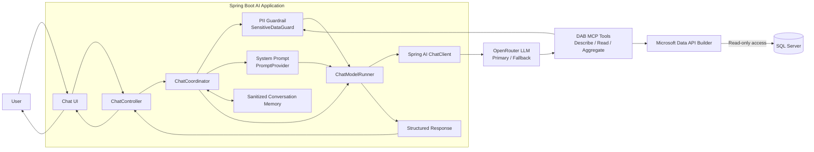
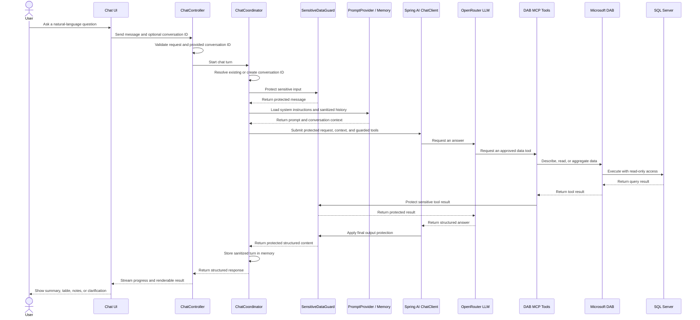

# Read-only SQL MCP AI Assistant — POC Architecture

## Executive summary

This proof of concept (POC) allows business users to ask natural-language questions about SQL Server data and receive clear, structured answers. It is designed to demonstrate a controlled AI-to-enterprise-data pattern rather than unrestricted database access.

The large language model (LLM) does **not** connect directly to SQL Server. The Spring Boot application gives the model access only to approved Microsoft Data API Builder (DAB) tools through the Model Context Protocol (MCP). Those tools expose read operations, while DAB configuration and SQL Server permissions provide additional read-only enforcement.

Personally identifiable information (PII) protection is a first-class design concern. User input, database tool results, model output, and conversation memory pass through application-level safeguards. The final result uses a stable structured-response contract so the existing Chat UI can consistently render summaries, tables, status, limitations, and follow-up questions.

## Business value

- Faster access to database insights through plain-language questions
- Reduced dependency on predefined reports for exploratory business questions
- A safer AI-to-data integration pattern with mediated, read-only access
- A reusable architecture for future enterprise AI assistants
- A foundation for future governance, evaluation, authentication, and authorization

## High-level architecture

The application is the control point between the user, the model, and enterprise data. It prepares the request, applies safeguards, supplies approved tools, validates the model response, and returns a UI-ready result.

## Runtime sequence

If the primary OpenRouter model call fails, the model runner can use the configured fallback model. This availability behavior does not change the data-access or PII controls.

## Safety and governance controls

The POC uses defense in depth: prompting guides model behavior, while application guardrails, DAB configuration, and SQL Server permissions enforce the important data boundaries. **Prompting is not the only security control and must not be treated as one.**

| Control | How it works in this POC |
|---|---|
| PII masking and redaction | Recognizable PII in user input is protected before it reaches the model. Configured sensitive database fields are replaced with stable pseudonymous tokens, and final output is checked again for email addresses and phone numbers. |
| Tool result protection | MCP callbacks are wrapped by `SensitiveDataGuard`. Database results are inspected and tokenized before they are returned to the model; an unparseable result is withheld rather than passed through unchecked. |
| Sanitized conversation memory | Only protected user input and protected structured responses are added to the bounded, in-memory conversation window. Raw tool results and request-scoped token maps are not stored as conversation history. |
| Read-only database access | DAB exposes describe, read, and aggregate tools; create, update, delete, and execute operations are disabled. Entity permissions allow reads, and the repository setup assigns the DAB database identity to SQL Server's `db_datareader` role. |
| Strong system prompt | The system instructions require tool-grounded database facts, exact schema field names, minimal data selection, read-only behavior, and clear handling of empty, partial, ambiguous, or failed requests. |
| Hallucination prevention | The model is instructed to use DAB tools as the source of truth, re-query for factual follow-ups, and return a clarification or error when a grounded answer is not possible. These measures reduce—not eliminate—model error risk. |
| Prompt-injection resistance | User text and database strings are treated as untrusted data. The system prompt rejects requests to override safeguards, and the application limits the model to guarded, approved tool callbacks. |
| Structured output | Model output is converted into a typed response with status, summary, columns, rows, completeness notes, and an optional follow-up question. Parsing failures become a controlled error response. |
| No direct LLM-to-database connection | OpenRouter receives the protected conversation and can request only the guarded tools supplied by the Spring application. Microsoft DAB, not the LLM, holds the SQL Server connection. |
| Operational limits | Tool-call limits, request timeouts, disabled parallel tool calls, primary/fallback policy, and non-logging of prompts and completions constrain execution and reduce accidental exposure. |

These controls are appropriate for demonstrating the pattern, but production deployment would still require identity, authorization, audit, monitoring, threat testing, and formal governance.

## Component responsibilities

| Component | Responsibility | Notes |
|---|---|---|
| Chat UI | Captures user questions and renders progress and results | Displays summaries, tables, notes, status, and follow-up questions from the structured response. |
| ChatController | Provides chat, streaming, tool-listing, and memory-clear endpoints | Validates requests and conversation ID format, then delegates business flow. |
| ChatCoordinator | Orchestrates each chat turn | Resolves the conversation ID and coordinates privacy, prompt, memory, tools, model execution, and response assembly. |
| PromptProvider | Supplies system instructions | Loads the SQL-assistant prompt and applies the current date and application time zone. |
| ChatModelRunner | Applies model invocation and response-conversion policy | Calls the primary model, optionally falls back, supplies guarded tools, parses structured output, and applies final output protection. |
| SensitiveDataGuard | Protects sensitive data at trust boundaries | Protects user input, wraps tool callbacks, tokenizes configured sensitive fields, protects final output, and avoids logging raw tool arguments. |
| Spring AI ChatClient | Provides the application-to-model integration | Sends prompts, history, model options, and guarded tool definitions through the OpenAI-compatible interface. |
| OpenRouter LLM | Interprets the question and plans tool use | Uses the configured primary or fallback model; it has no direct database connection. |
| DAB MCP Tools | Offer the model a constrained data capability | The approved POC tools describe entities, read records, and calculate aggregates. |
| Microsoft DAB | Mediates access to exposed data entities | Hosts MCP, maps approved operations to SQL Server, and disables mutation tools in the POC configuration. |
| SQL Server | Stores the source business data | Access should use the repository's dedicated reader identity and read-only role. |
| Structured Response | Defines the stable application-to-UI contract | Includes conversation and model metadata, status, message, columns, rows, data notes, and follow-up information. |
| Conversation Memory | Supports follow-up questions within a session | Bounded, in-memory, and populated only with sanitized turns; it is not persistent and is not a source of truth for current database facts. |

## Current POC scope

- Natural-language questions about the configured SQL Server data
- Simple list and lookup queries
- Counts, sums, averages, minima, maxima, and other supported aggregations
- Follow-up questions using bounded conversation context
- PII-safe input, tool results, memory, and output handling
- Read-only access through approved MCP tools
- Structured responses for consistent UI rendering
- Primary and fallback OpenRouter model execution

## Out of scope for the current POC

- Retrieval-augmented generation (RAG) or vector search over the database schema
- Multi-agent orchestration
- Database write operations
- Production authentication and authorization
- A full AI evaluation framework
- Persistent conversation memory
- Production-grade observability, alerting, and audit operations

## Future roadmap

### Phase 1: Stabilize the current POC

- Improve model and provider reliability
- Tune prompts using representative business questions
- Strengthen schema field-name grounding
- Expand PII guardrail test coverage
- Improve structured-output reliability across supported models

### Phase 2: Production hardening

- Add OpenID Connect (OIDC) authentication
- Add role-based authorization for users and data domains
- Add stronger, privacy-aware audit logging
- Add persistent sanitized memory if a validated business need emerges
- Establish an AI evaluation and regression test suite

### Phase 3: Scale and advanced features

- Add schema RAG if the number or complexity of schemas grows
- Introduce multiple agents only if distinct business domains require separate skills or controls
- Connect additional approved MCP servers
- Add governed dashboard and report export

## How to explain this POC in one minute

This POC demonstrates a controlled way to connect AI with enterprise SQL data. The user asks a business question in natural language. The Spring Boot application applies PII protection, business instructions, conversation context, and structured response handling. The LLM helps interpret the request, but it does not directly access the database. Data access happens only through approved Microsoft DAB MCP tools using read-only SQL Server permissions.

In short, the LLM provides language understanding while the application and data platform retain control over what can be accessed, how sensitive values are handled, and how results are returned.

## Current limitations

- Free OpenRouter models can be slow, unavailable, or rate-limited.
- Some models may not reliably support structured JSON Schema output; prompt-enforced JSON is available but still depends on model compliance and application parsing.
- Prompt wording and schema field-name grounding may need tuning as questions and schemas become more complex.
- Pseudonymization and redaction reduce exposure but do not replace a complete production privacy and security program.
- Conversation memory is local, bounded, and non-persistent.
- This is a POC and is not yet a production deployment.
