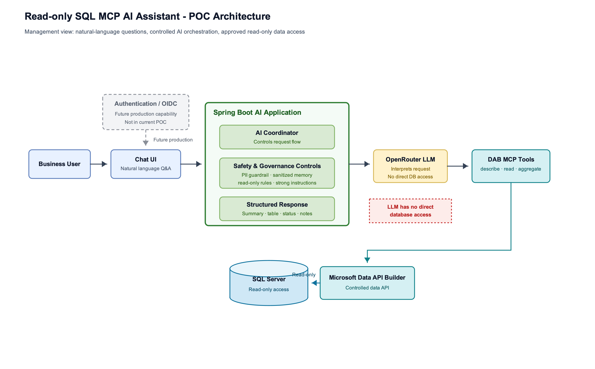
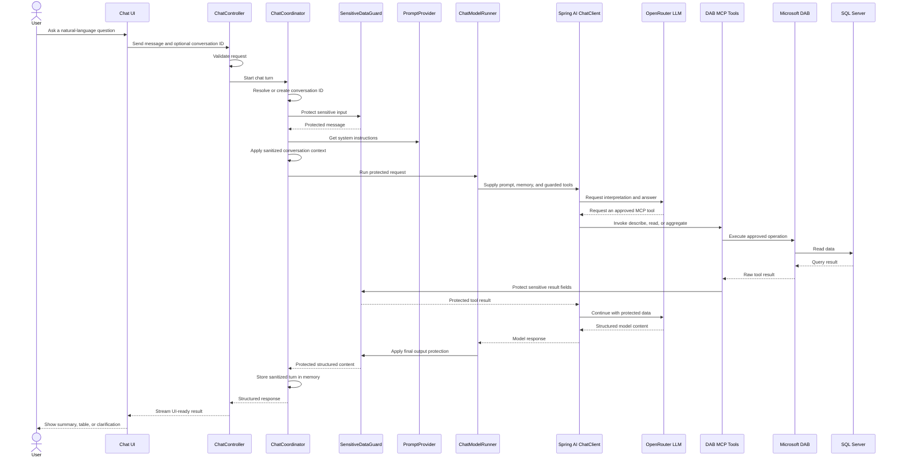

# Read-only SQL MCP AI Assistant — POC Architecture

## Executive summary

This proof of concept (POC) lets business users ask natural-language questions about SQL Server data through an existing chat interface. A single Spring Boot coordinator applies system instructions, sanitized conversation context, PII safeguards, and structured-response handling. The LLM interprets the request but never connects directly to the database: approved Microsoft Data API Builder (DAB) MCP tools mediate access, mutation tools are disabled, and SQL Server access is read-only. Authentication and enterprise authorization are future production capabilities, not features of the current POC.

## Architecture at a glance

The editable source diagram is available at [docs/sql-mcp-poc-architecture.drawio](sql-mcp-poc-architecture.drawio). Open it with [diagrams.net](https://app.diagrams.net) or the draw.io VS Code extension. A vector version is also available at [docs/sql-mcp-poc-architecture.svg](sql-mcp-poc-architecture.svg) for slides and printed handouts.

Reading the diagram in one pass:

| Band | What it shows |
|---|---|
| User experience | A business user asks questions through the chat UI. Authentication / OIDC is shown as a future production capability, not part of the current POC. |
| AI application | The Spring Boot AI Application coordinates the request, applies safety and governance controls, and returns a structured response for the UI. |
| Model | The OpenRouter LLM interprets the request, but it has no direct database access. |
| Data access | DAB MCP tools expose approved describe, read, and aggregate operations through Microsoft Data API Builder. SQL Server access is read-only. |

## Interactive Layer-by-Layer Query Flow

Use this walkthrough to see what each layer receives, how it transforms the request or data, and what it sends to the next layer.

[Open interactive query flow](./interactive-query-flow.html)

## Plain-English capabilities

**PII Guardrail:** Protects sensitive values such as customer names, emails, phone numbers, and references.

**Sanitized Conversation Memory:** Stores only safe chat context so follow-up questions can work without retaining raw sensitive data.

**Structured Response:** Formats the answer predictably for the UI, for example status, message, columns, rows, and notes. It is not a security control by itself.

## Technical appendix: runtime flow

## Safety controls

- The LLM does not directly access SQL Server.
- DAB MCP exposes only approved describe, read, and aggregate tools; mutation tools are disabled.
- SQL Server access uses a dedicated read-only database role.
- PII is protected in user input, model output, and database tool results.
- Conversation memory stores only sanitized context and remains in memory for the POC.
- A strong system prompt reinforces read-only behavior, schema grounding, prompt-injection resistance, and hallucination prevention.
- A typed structured response makes UI rendering predictable and turns parsing failures into controlled errors.
- Prompting is not the sole security control: application guardrails, DAB configuration, and SQL Server permissions enforce the key boundaries.

## Component responsibilities

The diagram uses business-facing labels. This table keeps the responsibilities at the same level of detail as the management view.

| Diagram label | Responsibility |
|---|---|
| Business User | Asks natural-language questions about business data. |
| Chat UI | Collects questions and renders predictable results. |
| Spring Boot AI Application | Coordinates request handling, safety controls, model interaction, and UI-ready responses. |
| AI Coordinator | Controls request flow for each chat turn. |
| Safety & Governance Controls | Applies PII protection, sanitized memory, read-only rules, and strong instructions. |
| Structured Response | Formats status, message, columns, rows, and notes for the UI. |
| OpenRouter LLM | Interprets the request and requests approved tools; it has no direct database connection. |
| DAB MCP Tools | Provides approved describe, read, and aggregate operations. |
| Microsoft Data API Builder | Mediates the configured entities and permitted data operations. |
| SQL Server | Stores source data and enforces read-only access. |
| Authentication / OIDC | Future production capability; not included in the current POC. |

## Current scope and future scope

| Current POC | Future / Production |
|---|---|
| Natural-language database questions | Production authentication with OIDC |
| Read-only data access | Role-based authorization (RBAC) |
| Structured UI response | AI evaluation and regression testing |
| PII-safe output and protected tool results | Schema RAG if schema size or complexity grows |
| Simple follow-up context using sanitized memory | Multi-agent orchestration only if distinct business domains require it |

## How to explain this POC in one minute

> This POC demonstrates a controlled way to connect AI with enterprise SQL data. The user asks a natural-language question. The Spring Boot application applies PII protection, strong instructions, conversation context, and structured response handling. The LLM helps interpret the request, but it does not directly access the database. Data access happens only through Microsoft DAB MCP tools using read-only SQL Server access.
